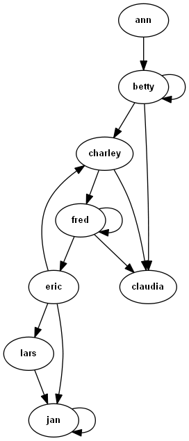

# Anygraph

_The easiest way to construct and use graphs in Python_.




## Introduction

Graphs are used in many software implementations, varying from file systems to web analysis tools, game engines to parsers and routers to state machines (not all implementation call them graphs, but they are). Graphs and especially double-linked graphs (with relations going for- and backwards) are easy to get wrong. After having written a number of tree and other graph libraries, usually as mixin classes, I found a different solution that has a number of advantages. Is consists of only 2 classes: `One` and `Many` and only a few optional parameters. With these classes you can create many types of graph, which in turn opens the way to a number of (included) algorithms associated with graphs and graph traversal.    

Alternatives that I could find on GitHub or PYPI did not meet my requirements, either being inflexible/more coupled (e.g. requiring inheritance), or missing easy-to-find documentation.

_Anygraph_ can be used to build _trees_, _directed_ and _non-directed graphs_, _cyclic_ and _non-cyclic graphs_. It also supports mixing many-to-many, many-to-one and one-to-one relationships. It makes graph construction trivial and includes methods/algorithms for:

* Depth and breadth-first iteration,
* _Building_ a graph from any relationship between objects, of the same or different classes,
* Dijkstra and A* shortest path algorithms,
* Applying a function to each connected node in the graph, possibly altering the graph, 
* Traversing the graph with a key-function to select the next node,
* Checking for cycles or if a node is reachable from another node,
* Gathering all nodes or all nodes passing a filter in the graph, from forward and backward relationships,
* Finding the endpoints of the graph, where progression is no longer possible.

There are many more known algorithms related to graphs. If you miss the algorithm in this library, please let me know, or create it yourself on the top of the basic graph structure in this repo and make a pull-request.

No inheritance is needed, a graph structure can simply be added to a class by setting one or two class attributes on your (possibly existing) class.

## Installation

Anygraph can be installed using pip:

`> pip install anygraph`

Anygraph has no dependencies (apart from graphviz if you want to draw a graph). It runs on Python 3.6 and higher.

## Testing

Unit tests can be found in `anygraph/unittests`

## The Basics

Anygraph uses two classes: `One` and `Many`. Single linked graphs enable a number of algorithms (as long as you follow the graph only in one direction) and can be defined as follows:
```python
from anygraph import One, Many

class SomeLink(object): # a directed chain
    next_link = One()

class SomeNode(object): # a directed graph
    next_nodes = Many() 
```
More powerful is the ability to create double linked graphs. In that case `One` and `Many` need to be initialized with the name of the reverse relationship:
```python
class Person(object): # a non-directed graph
    friends = Many('friends') 

class Node(object): # a double-linked directed graph
    nexts = Many('prevs')
    prevs = Many('nexts')

class TreeNode(object):  # a  double-linked tree graph
    parent = One('children')
    children = Many('parent')

class Link(object): # or a  double-linked chain of objects
    next = One('prev')
    prev = One('next')
```
This also means that you can easily add a graph structure to existing objects, just by adding a class attribute. Note that any names can be used, names like 'parent' are used for clarity.

The next step is to actually construct a graph; linking the nodes together. Let's take the Person class as an example:
```python
bob = Person()
ann = Person()
jim = Person()
jan = Person()

bob.friends = [ann, jim]  # let's make some friends
assert bob in ann.friends and bob in jim.friends  # check the reverse relation

jan.friends.include(ann)  # let's give 'jan' a friend
assert ann.friends == {bob, jan}  # so 'ann' has 2 friends now

ann.friends.exclude(jan)  # it did't work out
assert ann.friends == {bob}
```
In short: changes to a `Many` (and `One`) double linked relationship will always **update the reverse relationships** and break existing relationships when needed.

* A `One` relationship supports the normal attribute operations: `n.parent = child`, `del n.parent`, `n.parent = None` (same as `del`)
* A `Many` relationship supports the same methods and operations as the immutable abc.Set + `.include(*nexts), .exlude(*nexts), clear()` and assignment of an iterable  (e.g. `node.children = [child1, child2]`) and deletion (e.g. `del node.children`).  

Note that the insertion order of the children is maintained; the underlying data-structure is a `dict`, not a `set`. Any object can be used as node in the graph, not only objects that are hashable. 

### Installing a Graph

In many examples below, you see calls like `Person.friends.iterate(person_instance, ...)`. This might seem a bit too complicated for general use (there is a reason though, see below). To be able to make the calls simpler and more intuitive you can install a graph attribute:

```python
class Person(object):
    friends = Many('friends', install=True)  # 'install' works for all types of graph
        
bob = Person()
ann = Person()
bob.friends = [ann]

# now you can (e.g.):
assert list(bob.iterate()) ==  [bob, ann]	 # instead of Person.friends.iterate(bob)
assert bob.shortest_path(ann) == [bob, ann]  # instead of Person.friends.shortest_path(bob, ann)
assert bob.in_cycle()						 # instead of Person.friends.in_cycle(bob)
```

This works for all methods on the graphs described in this readme. You do not have to install any graph attribute.

*Note*: The reason the graph is not installed by default is that if there are multiple graph attributes, it is unclear which graph should be used in the methods installed (should `.iterate()` follow the parent or the children edges?). This means you can only install one `Many` or `One` on a class. If you try to install more, a `ValueError` is raised.

### Cycles in Graphs

If you do not want to have cycles in the graph, you can set (for example):
```python
class Node(object):
    nexts = Many(cyclic=False)

node1, node2 = Node(), Node()
node1.nexts.include(node2)
node2.nexts.include(node1)  # raises ValueError
```
When you create a link that would create a cycle in the graph, this will raise a `ValueError`. This will also prevent a cycle to be created through the reverse relationship. Note that a double-linked non-directed graph is always cyclic (I am a friend of my friend).

To check whether some node is in a cycle, call `Node.nexts.in_cycle(some_node)` or `some_node.in_cycle()` if `nexts` is installed. To check whether there are any cycles in the graph reachable from a node, call `Node.nexts.is_cyclic(some_node)`. These can only be the case if `cyclic=True`: the default.

### Self-reference

If you want to prevent objects from having a relationship to themselves, use:
```python
class Node(object):
    nexts = Many(to_self=False)

node = Node()
node.nexts.include(node)  # raises ValueError
```
This will also cause a `ValueError` to be raised when tried. Note that `cyclic=False` will also prevent self-reference.

> These are the basics for creating a number of different types of graph. Creating graphs in this decoupled way, makes it 
>relatively easy to add functionality. Below are a number methods that can be applied to these graphs out-of-the-box. 


## Samples

Below are code samples for the use of extra functionality that is currently included in _anygraph_. More examples can be found in the `demos` and `recipes` directories. 

> Note that all methods below follow the same calling pattern: `Class.relationship_name.method_name(instance, *args, **kwargs)`, where usually the instance is the starting node in the graph, e.g.: `Parent.children.iterate(some_parent)`. See *'Installing a Graph'* below for an alternative way of calling these methods.

These methods are implemented on both `One` and `many`:

* `.build(start_obj, key='__iter__')`: build a graph using a key function that iterates over the next nodes to be inserted in the graph,
* `.iterate(start_obj, cyclic=False, breadth_first=False)`: iterate through the graph, depth- or breadth-first, allowing revisiting nodes or not with `cyclic`,
* `.find(start_obj, filter)`: run through the graph and gather and return a list of nodes for which `filter(node)` returns `True`,
* `.visit(start_obj, on_visit, cyclic=False, breadth_first=False)`: run through the graph and apply on_visit to each node that is encountered,
* `.shortest_path(start_obj, target_obj, get_cost=None, heuristic=None)`: returns the shortest path using A*, or Dijkstra if a `heuristic` is `None`. if `get_cost` is `None`, the default counts the edges to get to another node as cost, 
* `.walk(start_obj, key, on_visit=None)`: iterate over the graph using a key-function that returns the next node from `key(node)`,
* `.endpoints(start_obj)`: iterate over the graph and gather the nodes that do not have a next node,
* `.gather(start_obj)`: gather all nodes in the graph reachable from `start_obj` in a list, following the forward and reverse (if present) edges.

At the bottom of the chapter there are some more samples:

* Creating a graph that consists of nodes of different classes, mixing both `One` and `Many`,
* Using `on_link(...)` and `on_unlink(...)` callbacks to add do extra logic when nodes are linked or unlinked,
* Using `save_image` to create and save an image of a graph.

Note that all these methods can be called as e.g. `Person.friends.some_method(start_obj, ...)`; on the `Person` class; to call the methods in the instance, see '*Installing a Graph*' above. 

### Graph Iteration

There are several ways to iterate through a graph. Most common are depth first and breadth first. Both are supported out of the box. For example:
```python
class Person(object):
    friends = Many('friends') 

bob = Person()
ann = Person()
ann.friends.include(bob)
# ... create a network of friends

# iterate through the graph in depth first order
for friend in Person.friends.iterate(bob):  # note we call friends on Person, not bob
    print(friend)

# or short
for friend in Person.friends(bob): 
    print(friend)
```
This will iterate through the graph, by default not in cycles and depth-first. To change this do (for example):
```python
for friend in Person.friends(bob, cyclic=True, breadth_first=True):
    print(friend)
```
If nodes are not reachable from the starting node through the graph, they will not show up during iteration. If you wan to check reachability, do `Person.friends.reachable(from_person, to_person)`, in the example above.

### Building a Graph

Graphs can often be automatically constructed by using the 'build' method. This only needs a function or method_name (or attribute name for `One` relationships). An rudimentary example:
```python
from anygraph import One, Many

class Items(object):
    children = Many('parent')

    def __init__(self, items=None):
        self.items = items or []

    def extend(self, items):
        self.items.extend(items)

    def __iter__(self):
        return iter(self.items)

class Item(object):
    parent = One('children')

    def siblings(self):  # only works after the graph has been built
        return [s for s in self.parent.children if s is not self] 

# add items to an Items object
items = [Item() for _ in range(5)] 
items_obj = Items(items)

assert items[0].parent is None  # nothing yet

Items.children.build(items_obj)  # build the graph! give an entry point object to build the graph from

# which is the same as
Items.children.build(items_obj, key='__iter__')  # '__iter__' is the default

# or
Items.children.build(items_obj, key=lambda obj: obj.items)

# and now
assert all(item.parent is items_obj for item in items_obj)
assert items[0].siblings() == items[1:]
```
This makes all objects iteratively encountered by `build()` be part of the graph, to be iterated (depth- or breadth-first), traversed upward and downward; it makes the `Item.siblings()` method work. As long as a iterable relationship between objects exists or can be created, a double-linked graph can be built automatically.

Notes:
* The `key` function must return an iterable, this can also be a generator,
* The graph can traverse multiple unrelated object types/classes, as long as they have One or Many relationships defined with the same name,
* The graph will build cyclic relationships when it encounters repeated instances, identified with the python `id` function. This can be overridden by setting another id function in the relationship constructor, as in: `children = Many('parent', get_id=lambda obj: obj.name)`. 

A more in-depth example can be found in `anygraph\recipes\building_a_graph.py`

### Visiting the Graph

Another useful utility is the `.visit()` method. It is used to traverse the graph and apply a function/callable on any node encountered (using the example above):
```python
objs = []
def visit(obj):
    objs.append(obj)

Items.children.visit(items_obj, on_visit=visit)

assert objs == [items_obj] + items
```
Again the iteration order and allowing cycles in the iteration can be modified with `breadth_first` and `cyclic` (see Iteration).

### Shortest Path

Often a shortest path between to nodes in a graph must be found (e.g. in route-planners or in games). _Anygraph_ provides two algorithms to calculate shortest path. Let's say we have a graph consisting of nodes that have already been connected and we want the shortest route between the first and last node (or between any other nodes):
```python
class Node(object):
    nexts = Many('prevs')
    prevs = Many('nexts')

nodes = create_and_connect_nodes()  # some graph is constructed

# we need a cost function to be able to define shortest. The function below minimizes the number of edges in the path.
def cost(node1, node2):
    if node1 is node2:
        return 0
    return 1

# shortest path
path = Node.nexts.shortest_path(nodes[0], nodes[-1], get_cost=cost)

# If a (lower-) estimate of the remaining cost from any node to the target node can be made:
def heuristic(node1, node2):
    return 'lower estimate of cost from node1 to node2'

#shortest path but faster
path = Node.nexts.shortest_path(nodes[0], nodes[-1], get_cost=cost, heuristic=heuristic)
```
With a heuristic function, the A* algorithm is used; without, the method falls back to Dijkstra. A lower estimate means that the estimate is always smaller or equal than the real cost. In geographic pathfinding the heuristic is often the straight line (euclidic) distance or travel-time to the endpoint. 

A more in-depth example can be found in `anygraph\recipes\shortest_path_in_grid.py`

### Walking the Graph

Another option is to iterate through the graph by picking the next node with a key function:
```python
from random import choice

class Person(object):
    friends = Many('friends')

people = create_and_connect_people()

# as an example, a random walk through the graph can be created with:
for person in Person.friends.walk(people[0], key=lambda p: choice(p.friends)):
    print(person)

# if you want a node to be pre-processed before showing up in the iteration, you can pass an on_visit function
for person in Person.friends.walk(people[0], key=lambda p: choice(p.friends), on_visit=lambda p: print(p)):
    pass

```
`walk()` will run forever unless a dead-end is encountered (in the non-directed graph above this will never happen, because the the walk can always return to the last node) or you `break` out of the loop. Picking the next node essentially happens through `next_node = key(node)`. 

### Mixed Nodes

The nodes in the graph do not have to be of the same class, as long as the relationships have the same name. Let's give edges in the graph their own class:
```python
from anygraph import One, Many

class Node(object):
    nexts = Many('prevs')
    prevs = Many('nexts')

class Edge(object):  # an edge only connects to one node on each end
    nexts = One('prevs')
    prevs = One('nexts')

    def __init__(self, prev, next):
        self.prevs = prev
        self.nexts = next

def create_and_connect_nodes(num):
    """ for example: connect all nodes with all nodes """
    nodes = [Node() for _ in range(num)]
    for node1 in nodes:
        for node2 in nodes:
            Edge(node1, node2)
    return nodes

nodes = create_and_connect_nodes(5)

# now lets run through the graph.
for node_or_edge in Node.nexts(nodes[0]):  # or Node.prevs(nodes[0]) to follow the reverse graph
    print(node_or_edge.__class__.__name__)

"""
This will print:
Node
Edge
Node
Edge
etc. 
"""
```

### Callbacks

The `One` and `Many` classes support 2 callbacks: `on_link(obj, linked_obj)` and `on_unlink(obj, linked_obj)`. For example in the mixed node example above, you might want to prevent dangling Edge objects (only linked on one side). This can be achieved by using `on_unlink`:
```python
def on_next_unlink(obj, linked_obj):
    del obj.prevs
    
def on_prev_unlink(obj, linked_obj):
    del obj.nexts
    
class Edge(object):  # an edge only connects to one node on each end
    nexts = One('prevs', on_unlink=on_next_unlink)
    prevs = One('nexts', on_unlink=on_prev_unlink)
```

### Creating an Image

Graphs can now be visualized in an image file of different formats: 

```python
class Person(object):
    friends = Many('friends', install=True)
    
	def __init__(self, name):
        self.name = name

people = create_and_connect_people()
Person.friends.save_graph_image(people[0], 'friends.png', label_getter=lambda obj: obj.name, view=True)
# or
people[0].save_graph_image('friends.png', label_getter=lambda obj: obj.name, view=True) # because the friends 
```

* The first argument (in this case `people[0]`) is the entry point of the graph to be drawn,
* The second (`friends.png`) is the filename the image will be saved to; the extension determines the format,
* `label_getter` is a function that gets the label from the node, it must return the text to be shown in the nodes,
* `view` indicates whether the file should be opened after generation in the registered program for the file name extension,
* `graphviz` is used and must be installed (see  [graphviz](https://graphviz.readthedocs.io/en/stable/manual.html)). More info on file formats, etc. can be found there as well,
* You can see an example image at the start of this readme.

## Authors

Contributing authors are:

* Lars van Gemerden - initial work - _rational-it_

## License

This project is licensed under the MIT License - see the `LICENSE.txt` file for details

